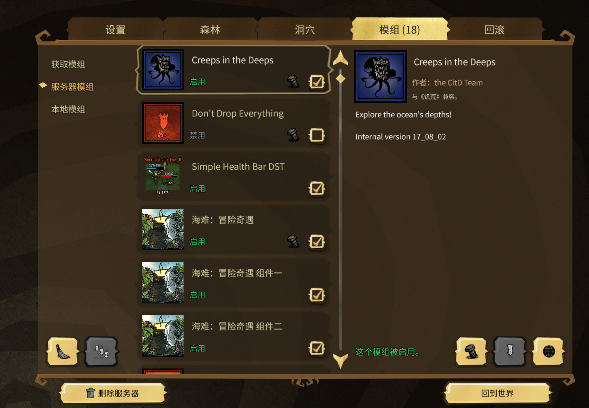
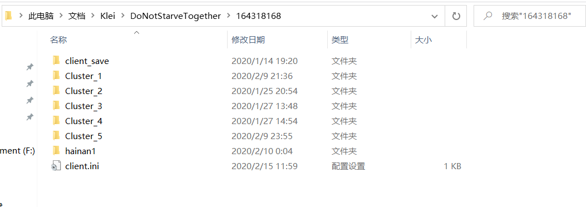
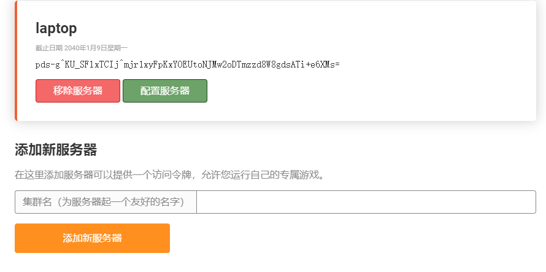
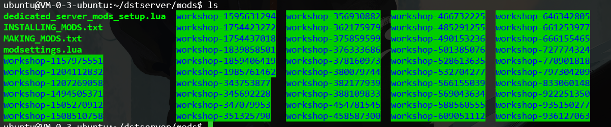

# 《饥荒独立服务器搭建》
::: tip 关于本章
饥荒服务器商Klei的服务器在国内不是很友好，客机体验极差，因此在云服务器上搭建一个独立的服务器是很好的选择，
:::

## 软件版本注意
以下列出我使用的各软件版本
| 软件列表                                                 |
| -------------------------------------------------------- |
| ubuntu 18.04LTS                                           |
| steamcmd                                               |

## 游戏准备
### 1. 游戏建档
打开游戏，新建一个档，配置好游戏选项以及勾选需要的mod,生成世界
<br>
在游戏开始界面打开`数据`即可进入存档目录，根据建档时间找到相应的档目录即可,该档用于后续服务器端配置
<br>

### 2.新建并备份服务器密钥
在游戏开始界面打开`账号`->`游戏`->`饥荒联机版的游戏服务器`，添加服务器并备份服务器密钥
<br>
### 3.备份用户ID
<br>

## 服务器端配置
### 1.安装`steamcmd`
> steamcmd是一个用于安装和更新steam上各种专用服务器的官方客户端

```bash
useradd -m steam #为了使用安全，以root权限创建steam用户
cd /home/steam
# 安装依赖
sudo add-apt-repository multiverse
sudo dpkg --add-architecture i386
sudo apt update
sudo apt install lib32gcc1 steamcmd 
```

### 2. 进入`steamcmd`，安装饥荒联机版服务器客户端
登陆
```bash
./steamcmd.sh
login anonymous # 匿名用户登陆，需要账户则login <username>
```
下载专用服务器
```bash
force_install_dir ../dontstarvetogether_dedicated_server #设置专用服务器下载的位置
app_update 343050 validate # 安装并验证软件版本 app_update <app_id> [-beta <betaname>] [-betapassword <password>] [validate]
quit
```
::: warning
需要注意饥荒游戏更新后，若专用服务器软件未更新，当开启饥荒服务器时，游戏上是搜索不到服务器的，需要再一次执行上述安装的命令检查更新后再重新启动服务器
:::

### 3. 上传游戏档
将上文中备份的游戏档上传至云服务器，位置为
```bash
/home/.klei/DoDoNotStarveTogether
```

### 4. 配置启动脚本
脚本中注释的目录位置请根据个人配置自行核对更改
`vim ./start.sh`
```bash
#!/bin/bash

steamcmd_dir="$HOME/steamcmd" # steamcmd的目录，根据个人配置更改
install_dir="$HOME/dstserver" # 饥荒专用服务器安装目录，根据个人配置更改
cluster_name="hainan"  # 游戏档目录名称，根据个人配置更改
dontstarve_dir="$HOME/.klei/DoNotStarveTogether" # 饥荒数据目录

function fail()
{
        echo Error: "$@" >&2
        exit 1
}

function check_for_file()
{
    if [ ! -e "$1" ]; then
            fail "Missing file: $1"
    fi
}

cd "$steamcmd_dir" || fail "Missing $steamcmd_dir directory!" # TODO

check_for_file "steamcmd.sh"
check_for_file "$dontstarve_dir/$cluster_name/cluster.ini"
check_for_file "$dontstarve_dir/$cluster_name/cluster_token.txt"
check_for_file "$dontstarve_dir/$cluster_name/Master/server.ini"
check_for_file "$dontstarve_dir/$cluster_name/Caves/server.ini"


check_for_file "$install_dir/bin"

cd "$install_dir/bin" || fail 

run_shared=(./dontstarve_dedicated_server_nullrenderer)
run_shared+=(-console)
run_shared+=(-cluster "$cluster_name")
run_shared+=(-monitor_parent_process $$)
run_shared+=(-shard)

"${run_shared[@]}" Caves  | sed 's/^/Caves:  /' &
"${run_shared[@]}" Master | sed 's/^/Master: /'

```

### 5. mod配置
在原先新建好的档已经配置好了mod,在启动服务器时就会开始下载相应的mod，mod下载目录为`<专用服务器安装目录>/mods`，第一次启动时可以直接从本地将相应的mod文件上传至云服务器，我的本地mod文件所在目录位置为`D:\steam\steam\steamapps\common\Don't Starve Together\mods`
<br>
如果需要继续添加mod，可以更改mod文件配置，这里先解析一下游戏档的目录结构
```bash
Cluster_1
  -Caves # 洞穴配置文件
    - ...
    - ...
    - modoverrides.lua
  -Master # 地面配置文件
    - ...
    - ...
    - modoverrides.lua
  -cluster.ini # 服务器配置文件
  -cluster_token.txt # 服务器密钥
  -adminlist.txt #管理员名单
```
在两个`modoverrides.lua`文件中添加相应的mod项即可，如果不知道添加方法，可以新建一个带该mod的档，复制mod配置文件中的项即可

### 6.添加服务器密钥和管理员名单
在游戏档中添加`cluster_token.txt`（服务器密钥文件），将上文备份的密钥复制进文件中
在游戏档中添加`adminlist.txt`（管理员名单文件），将上文备份的自己的用户ID复制进文件中

### 7.启动服务器
```bash
./start.sh
```
启动成功后可以看到`Sim pause`,`register in xx`字样