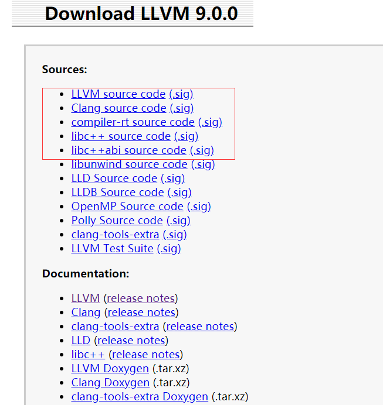
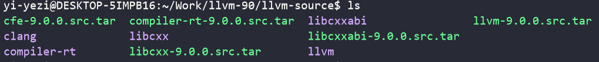
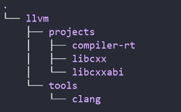
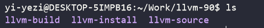

# 《llvm9.0.0安装教程》
::: tip 关于本教程
llvm作为后端与前端clang配合可以快速方便地构造编译器，而llvm的build、配置过程较为麻烦（各种依赖、环境变量配置、build的麻烦），特此记录下来，方便你我
:::

## 软件版本与下载
### 软件版本与环境
| 软件列表                                                 |
| -------------------------------------------------------- |
| cmake-3.16.2                                |
| ninja-1.8.2                                               |
| llvm-9.0.0  配套对应版本clang compiler-rt libcxx libcxxabi     |
|libffi-dev libtinfo-dev|
|gcc g++|

|环境|
|-----|
|ubuntu18.04LTS-搭载于linux on windows-wsl2|
|内存-8G|

### 软件下载
> cmake、ninja下载与安装配置网上教程较多，自行查阅

#### 使用`ninja`的原因：
* llvm编译十分耗时且占用内存，经测试，使用makefile来编译，8G内存即使使用swap分区、gold等奇技淫巧都不能满足编译，会在编译过程中由于内存不足终止
* ninja是一个小而快的build系统，在build速度、占用内存等方面优于makefile,使用ninja,8G内存足以完成llvm编译

#### llvm下载
在 *[llvm下载页](http://releases.llvm.org/download.html#9.0.0)* 选择对应版本的源码压缩包，为满足基本需求，要下载`LLVM source code`,`Clang source code`,`compiler-rt source code`,`libc++ source code`,`libc++abi source code`:

<br>
下载完成后对压缩包解压并更改名称:
<br>

## 编译流程
### 1.首先调整目录结构
在修改好文件夹名称后，将对应的文件夹放于llvm目录下，放置结构如图：

<br>

### 2.创建build与install文件夹
如图，build目录用于build文件放置，install目录用于最后install文件放置
<br>

### 3.进入build目录使用cmake生成build文件
build前先检查是否已安装`libffi-dev`,`libtinfo-dev`,`gcc`,`g++`

注意要在build目录下进行，根据自己实际情况对cmake参数进行修改
```bash
cmake -G Ninja ../llvm-source/llvm \ # 设定build类型用于Ninja，以及源码目录
  -DCMAKE_INSTALL_PREFIX=/home/yi-yezi/Work/llvm-90/llvm-install \ # 设定install目录
  -DCMAKE_BUILD_TYPE=Release \ # 设定为release模式，比debug模式编译更快，存储占用更少
  -DLLVM_ENABLE_FFI=ON \
  -DLLVM_BUILD_LLVM_DYLIB=ON \
  -DCMAKE_EXPORT_COMPILE_COMMANDS=ON \
  -DLLVM_TARGETS_TO_BUILD="host" \ # 选择目标平台，默认情况下会生成所有平台的。这里设置成 host-only 只选择本机
  -Wno-dev
```

### 4.build与install
```bash
ninja # 开始build
ninja install # build完成后，install
```

### 5. 设置相关环境变量
修改`/etc/profile`文件，末尾一下路径，根据自己实际安装目录进行修改
```bash
export PATH=$PATH:/opt/cmake-3.16.2-Linux-x86_64/bin
export PATH=$PATH:/opt/llvm-install/bin
export LD_LIBRARY_PATH=$LD_LIBRARY_PATH:/opt/llvm-install/lib # 动态链接库位置
export C_INCLUDE_PATH=$C_INCLUDE_PATH:/opt/llvm-install/include # clang使用gcc的include路径
```

### 6.检查配置
测试clang，gcc,g++命令，测试编译使用llvm的文件

### 7.总结与建议
每次面对新环境、新软件的配置，真是很烦很费时，特别是需要cmake跨平台编译之类的，llvm的安装花费了我很多时间，开始没用ninja，直接使用make，在双系统、虚拟机、wsl,8G的笔记本，16G的台式都试过，无一成功，好不容易发现ninja可以，编译成功后由于一些环境变量设置错误，或是测试使用的文件版本不对应等问题让我误以为编译失败又浪费了许多时间，前前后后大概花了一周时间（哭了

不得不说，有的时候直接用docker开环境是真香，呜呜呜，搜索pull运行一气呵成，现成的配置，现成的工具，各种版本都有，发明docker的人~谢谢你，泰罗！


