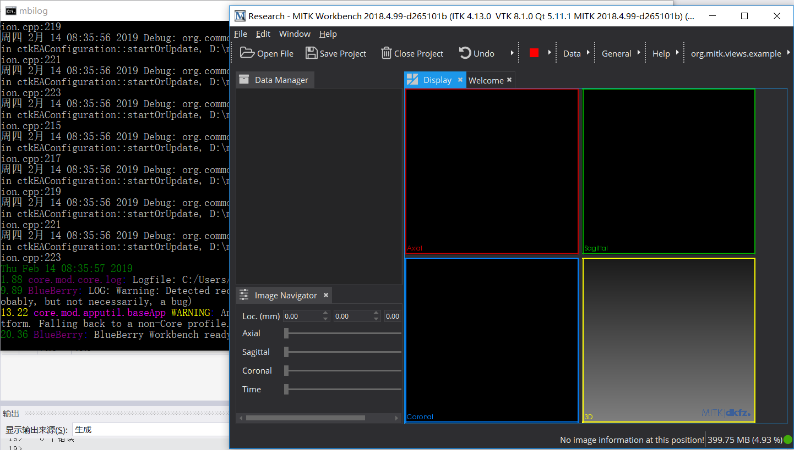

# 《MITK windows10编译教程》
::: tip 关于本教程
本篇博客介绍MITK平台在windows下编译的方法，由于网上已经有很多教程了，本不想重复造轮子，但自己在编译过程中遇到了一些其他人没有遇到过的问题，在此记录下来，帮助大家。
:::

::: tip 编译
MITK有源码目录，与superbuild目录，编译好的程序中一切修改都是对MITK源码目录中的文件进行的修改，因此即使编译了两份程序，如果共用的是同一份源码目录，那么是一样的
:::

*参考博客（请结合本文与以下博客学习）<br/>*
*[VS2017+Qt5.9.6+MITK-2016.11编译与安装-亲测有效2018-11-10](https://blog.csdn.net/qq_26477745/article/details/83934163)<br/>*
*[How to compile MITK on Ubuntu](https://neurita.github.io/how_to_compile_mitk_on_ubuntu)<br/>*
*[Install MITK in Ubuntu16.04LTS](https://wangchi.art/2017/03/09/Install-MITK-in-Ubuntu16-04LTS/)<br/>*
*[MITK: 编译过程](http://blog.51cto.com/weiyuqingcheng/2347996)<br/>*
*MITK交流群：242330546<br/>*
除此之外，我在解决问题过程中还查阅过很多资料，就不一一列举了，将在后文中讨论，在此感谢各位dalao们分享出自己的编译经验！<br/>


## 编译前注意事项

### git配置注意
```bash
git config --global core.autocrlf false
```
windows平台下，git默认pull时将LF换行符替换为CRLF，push时将CRLF替换为LF，这里要设置为不修改，分则会出现以下错误<br/>
**"cmd.exe"已退出，代码为3**


<br/>这几个错误是无法通过修改文件编码来解决的

### 软件版本注意
以下列出我使用的各软件版本，软件安装配置过程不再赘述，请参考文章开头链接：
| 软件列表                                                 |
| -------------------------------------------------------- |
| cmake-3.13.4-win64-x64                                   |
| qt 5.12.1                                                |
| vs2017 enterprise                                        |
| mitk git版本号`d265101b5e7102912b808302a0cf7e73784d8299` |
| git 2.16.1.windows.1                                     |
只要满足
*[Build Instructions](http://docs.mitk.org/2018.04/BuildInstructionsPage.html)*
中的条件，一般不会出问题，MITK使用git下载即可<br/>
`git clone https://phabricator.mitk.org/source/mitk.git MITK`<br/>
此命令会默认下载master分支上最新的节点，但如果你觉得该版本无法编译，可以切换到我编译成功的版本(`d265101b5e7102912b808302a0cf7e73784d8299`)试一试，方法为：<br/>
1. `git branch my_work d265101b5e` 创建my_work分支，指向给该节点<br/>
2. `git checkout my_work` 切换到my_work分支，此时本地版本已经变为`d265101d5e`这个版本了<br/>


## 编译流程

### 1. CMake生成项目
#### 1.1. 创建MITK-superbuild文件夹，第一次configure设置编译器


#### 1.2. 勾选你需要的配置，再次configure至没有红色条
* `MITK_BUILD_EXAMPLES`：MITK的几个简单插件例子，建议勾选以供学习
* `MITK_BUILD_ALLPLUGINS`：MITK的所有插件，建议勾选


#### 1.3. generate


#### 1.4. open project


### 2. ALL_BUILD
#### 2.1. 进入vs首先可以将输入日志详细级别提高一些，以方便查找错误：`工具->选项->项目和解决方案->生成并运行`将输出级别提高为普通或者详细


#### 2.2. 生成


#### 2.3. 不出意外，会出现1000+的警告和几个错误，不慌，

等生成完毕后，查看错误，一般为文件结束符（LF&CRLF）引起的错误，改变文件编码为UNICODE即可，然后继续点击生成

重复该步骤多次后就可以成功


### 3. 打开软件
打开 MITK-superbuild/Mitk-build/bin/startMitkWorkbench_debug.bat 即可打开软件



<script>
import mediumZoom from 'medium-zoom'  
export default {
  mounted() {
    mediumZoom('.container img')
  }
}
</script>