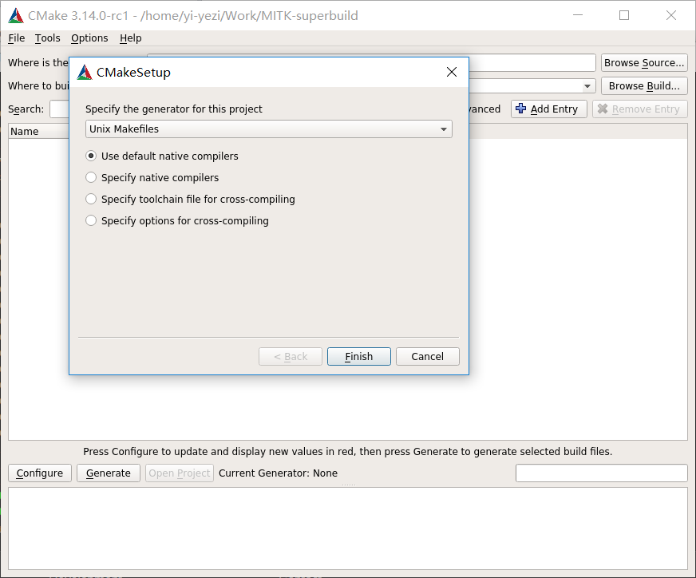
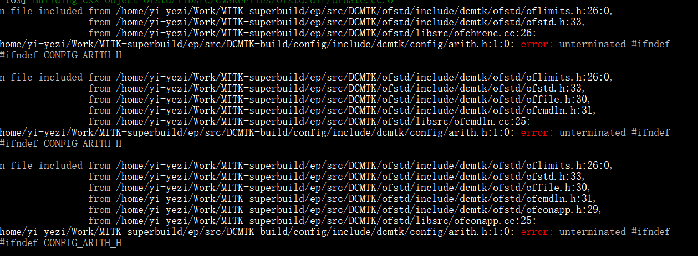
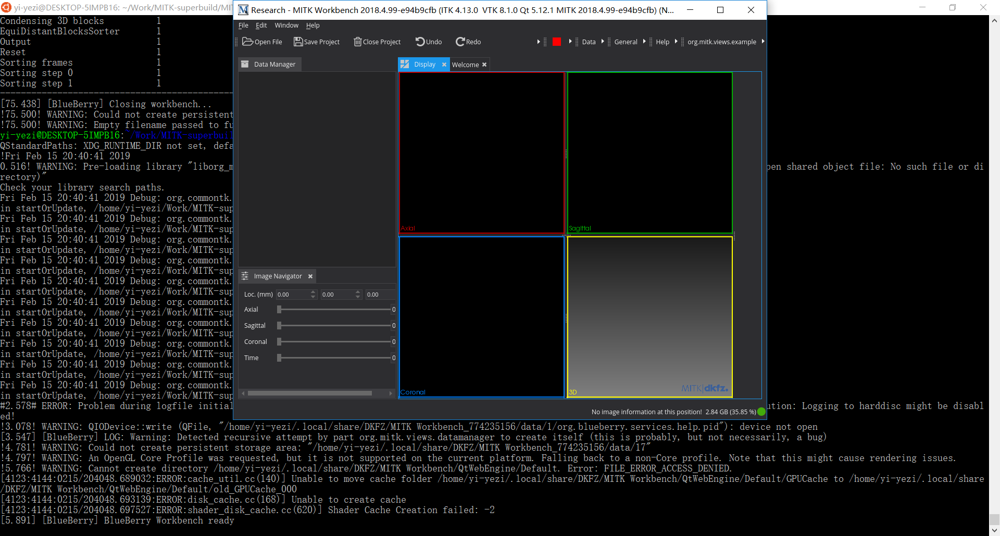

# 《MITK Linux编译教程》
::: tip 关于本教程
本篇博客介绍MITK平台在Linux下编译的方法，由于网上已经有很多教程了，本不想重复造轮子，但自己在编译过程中遇到了一些其他人没有遇到过的问题，在此记录下来，帮助大家。
:::

::: tip 编译
MITK有源码目录，与superbuild目录，编译好的程序中一切修改都是对MITK源码目录中的文件进行的修改，因此即使编译了两份程序，如果共用的是同一份源码目录，那么是一样的
:::

*参考博客（请结合本文与以下博客学习）<br/>*
*[VS2017+Qt5.9.6+MITK-2016.11编译与安装-亲测有效2018-11-10](https://blog.csdn.net/qq_26477745/article/details/83934163)<br/>*
*[How to compile MITK on Ubuntu](https://neurita.github.io/how_to_compile_mitk_on_ubuntu)<br/>*
*[Install MITK in Ubuntu16.04LTS](https://wangchi.art/2017/03/09/Install-MITK-in-Ubuntu16-04LTS/)<br/>*
*[MITK: 编译过程](http://blog.51cto.com/weiyuqingcheng/2347996)<br/>*
*MITK交流群：242330546<br/>*
除此之外，我在解决问题过程中还查阅过很多资料，就不一一列举了，将在后文中讨论，在此感谢各位dalao们分享出自己的编译经验！<br/>

## 编译前注意事项
::: warning 
在开始编译前，请先确保以下软件能够正常运行，qtcreator能够创建项目并构建运行
:::

### 软件版本注意
以下列出我使用的各软件版本，软件安装配置过程不再赘述，请参考文章开头链接：
| 软件列表                                                 |
| -------------------------------------------------------- |
| cmake-3.14.0                                             |
| qt 5.12.1                                                |
| mitk git版本号`d265101b5e7102912b808302a0cf7e73784d8299` |
| git 2.17.1                                               |
| ubuntu 18.04LTS                                          |
只要满足
*[Build Instructions](http://docs.mitk.org/2018.04/BuildInstructionsPage.html)*
中的条件，一般不会出问题，MITK使用git下载即可<br/>
`git clone https://phabricator.mitk.org/source/mitk.git MITK`<br/>
此命令会默认下载master分支上最新的节点，但如果你觉得该版本无法编译，可以切换到我编译成功的版本(`d265101b5e7102912b808302a0cf7e73784d8299`)试一试，方法为：<br/>
1. `git branch my_work d265101b5e` 创建my_work分支，指向给该节点<br/>
2. `git checkout my_work` 切换到my_work分支，此时本地版本已经变为`d265101d5e`这个版本了<br/>

### 环境变量配置
在开始编译前，请根据自己的目录自行调整,追加到~/.bashrc文件
```
export PATH=$PATH:/opt/cmake-3.14.0-rcl-Linux-x86_64/bin
export QTDIR=/opt/Qt5.12.1/5.12.1
export PATH=$QTDIR/gcc_64/bin:$PATH
export LD_LIBRARY_PATH=$QTDIR/gcc_64/lib:$LD_LIBRARY_PATH 
```

### 依赖包
在开始编译前提前安装<br/>
`libgl1-mesa-dev libxrender1 libxkbcommon-x11  mesa-common-dev libglu1-mesa-dev libtiff5-dev libwrap0-dev libxt-dev libnss3  libasound2 libxi-dev gdb gcc g++ `


## 编译流程
> 以下我使用的是WSL（bash on windows，版本为Ubuntu18.04LTS)配合X410进行演示的，与实际Linux下安装并无差异
### 1. CMake生成项目
#### 1.1. 创建MITK-superbuild文件夹，第一次configure设置编译器


#### 1.2. 勾选你需要的配置，再次configure至没有红色条
* `MITK_BUILD_EXAMPLES`：MITK的几个简单插件例子，建议勾选以供学习
* `MITK_BUILD_ALLPLUGINS`：MITK的所有插件，建议勾选


#### 1.3. generate


### 2. make
```
cd ~/MITK-superbuild
make -j6
```
该步骤可能会出现错误，但由于是多线程，其中一个线程运行错误，其他线程会运行完毕才会停止，导致错误信息被刷屏，因此make failed后继续多次`make -j6`，直至make停止在错误处无法继续，然后根据信息解决错误再继续make

其中我遇到的问题为 `arith.h文件没有#endif`,对比windows版本的文件，具体出错原因不知，但我发现直接手动给文件添加#endif也是可以的，添加后继续make即可



### 3. 运行软件
```
./MITK-superbuild/MITK-build/bin/MitkWorkbench
```

在未使用root权限运行时，发现无法写入数据库，因此更改该文件权限
```
sudo chmod 777 /home/yi-yezi/.local/share/DKFZ/MITK Workbench_774235156/plugins.db
```
之后再次运行，如果没有安装完上文中所给出的依赖包，会报错，安装完成后，即可成功运行


