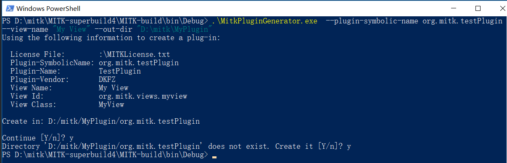
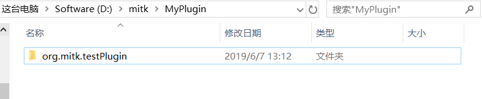
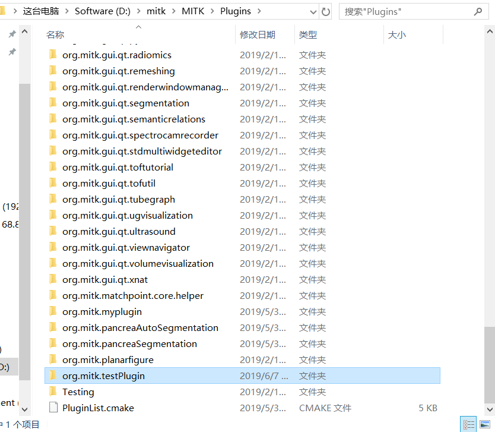
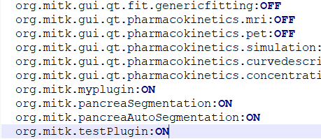
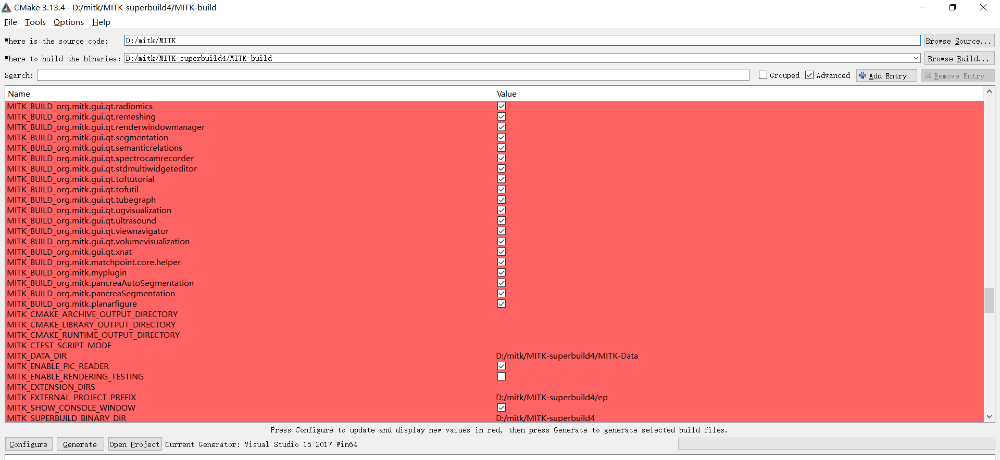

# 《MITK 添加插件教程》
*[官方教程](http://docs.mitk.org/nightly/NewPluginPage.html)<br/>*
::: tip 插件
MITK中有三个概念需要理解：module,plugin,view，这里按我的理解简单解释三者的区别：
* module: 为了便于使用，将一些常用的算法或者视图模块封装而成的共享库，编写需要修改cmake文件，参见`MITK/Modules`中的内容
* plugin: 同样是共享库，但相比于module多了方便插拔的特性，编写不需要修改cmake，一般自己的扩展都使用plugin的方式
* view: MITK程序中导航栏上每个按钮对应一个view，一个plugin可以有多个view
:::

::: tip 编译
MITK有源码目录，与superbuild目录，编译好的程序中一切修改都是对MITK源码目录中的文件进行的修改，因此即使编译了两份程序，如果共用的是同一份源码目录，那么是一样的
:::


## 详细步骤
### 1.使用MitkPluginGenerator.exe生成插件
该步骤会在指定的目录生成一个以插件名称命名的文件夹
```bash
D:\mitk\MITK-superbuild4\MITK-build\bin\Debug>.\MitkPluginGenerator.exe  --plugin-symbolic-name org.mitk.testPlugin --view-name "MyView" --out-dir "D:\mitk\MyPlugin"
```
具体参数请使用`-h`查看，其中需要注意的是：
* **`plugin-symbolic-name`**：插件的名称，命名必须符合`^org.mitk.[a-zA-Z0-9_]+$`或者`^org.blueberry.[a-zA-Z0-9_]+$`，否则在后面编译的时候会出现**MSB6006**的错误，该命名规范是在mitk源码目录CmakeLists.txt中定义的，可以自己更改，官方教程中使用`org.mycompany.myplugin`在没有更改规则的情况下是没法使用的！（这是一个神坑，无力吐槽）
* **`view-name`**：视图的名称，简单理解，一个视图，会产生导航栏上的一个图标




### 2.将插件文件夹放入源码目录，并修改`PluginList.cmake`文件


<br/>on就是cmake的时候默认✔

### 3.编译
* 如果是创建新项目，则编译方式与[MITK编译教程](./page1.md) 中一致，不过多赘述
* 这里说明的是使用已经编译好的目录的方法：<br/>
build目录选择为你原先编译的superbuild目录下的build目录，在第一configure后会出现更多的选项，其中包括各个pugin的选项，选择你需要编译的plugin即可，后续与[MITK编译教程](./page1.md) 中一致
